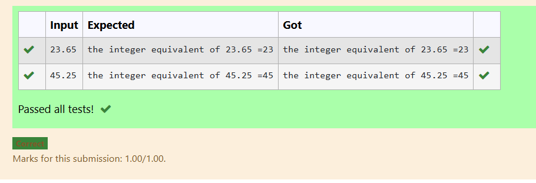
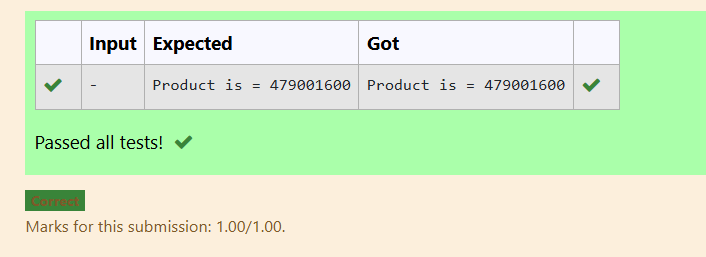
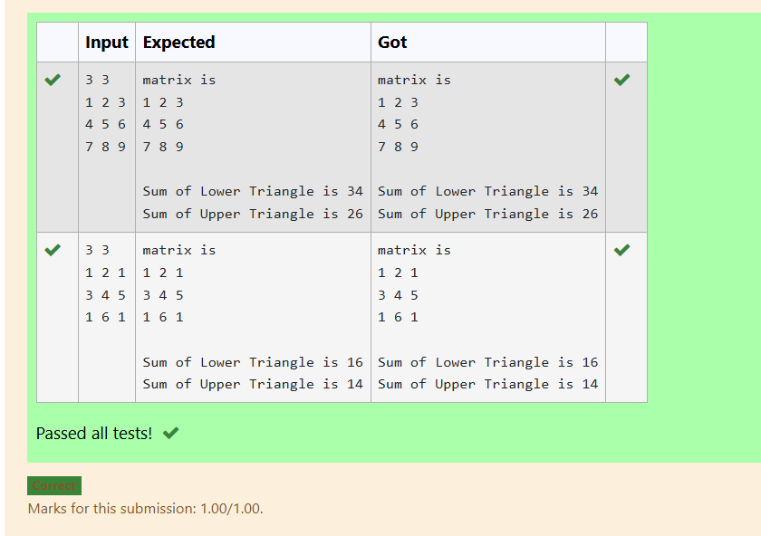
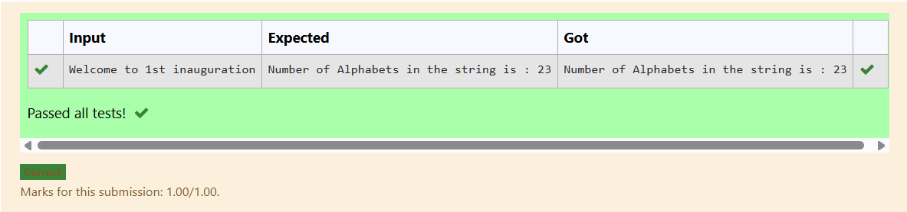
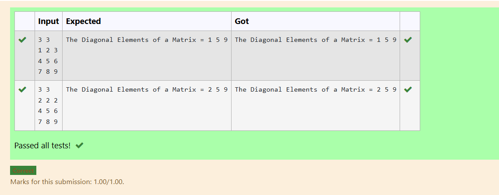

## Name: VANATHI T
## Reg no.:25013590

## EX-21-POINTERS
# AIM:
Write a C program to convert a 23.65 into 25 using pointer

## ALGORITHM:
1.	Declare a double variable to hold the floating-point number (23.65).
2.	Declare a pointer to double to point to the address of the variable.
3.	Use the pointer to modify the value to 25.0.
4.	Print the modified value.

## PROGRAM:
```
#include<stdio.h>
int main()
{
    float fnum, *pfnum=&fnum;
    int num, *pnum=&num;
    scanf("%f",&fnum);
    *pnum=(int)*pfnum;
    printf("the integer equivalent of %.2f =%d",*pfnum,*pnum);
    return 0;
}

```
## OUTPUT:
 	



## RESULT:
Thus the program to convert a 23.65 into 25 using pointer has been executed successfully.
 
 


# EX-22-FUNCTIONS AND STORAGE CLASS

## AIM:

Write a C program to calculate the Product of first 12 natural numbers using Recursion

## ALGORITHM:

1.	Define a recursive function calculateProduct that takes an integer parameter n.
2.	Return n multiplied by the result of the calculateProduct function called with n - 1.
3.	Declare an integer variable n and an unsigned long long variable product.
4.	Initialize n with the value 12 (for the first 12 natural numbers).
5.	Call the calculateProduct function with n and store the result in the product variable.
6.	Print the result, indicating it is the product of the first 12 natural numbers.

## PROGRAM:
```
#include<stdio.h>
long long product(int n){
    if(n==1){
        return 1;
    }
    else{
        return n*product(n-1);
    }}
    int main(){
        int n=12;
        long long result;
        result = product(n);
        printf("Product is = %lld",result);
        return 0;
    }
```
## OUTPUT:
         		
   
## RESULT:

Thus the program has been executed successfully.
 


# EX-23-ARRAYS AND ITS OPERATIONS

## AIM:

Write a C Program to print the sum of the upper and lower triangular of a matrix


## ALGORITHM:

1.	Start the program.

2. Declare a 2D array matrix[10][10], integer variables rows, cols, i, j, upperSum, and lowerSum.

3. Read the number of rows and columns (rows and cols) from the user.

4. Input matrix elements using nested loops:

5. Outer loop: for each row i

6. Inner loop: for each column j

7. Read matrix[i][j] from the user.

8. Display the matrix using nested loops.

9. Calculate sums of upper and lower triangular elements:

10. Nested loop over each element matrix[i][j]

11. If i >= j → add matrix[i][j] to lowerSum (elements on and below the main diagonal)

12. If i <= j → add matrix[i][j] to upperSum (elements on and above the main diagonal)

13. Print the sums: lowerSum and upperSum.

14. End the program.

## PROGRAM:
```
#include <stdio.h>

int main() {
    int matrix[10][10];
    int rows, cols;
    int i, j;
    int upperSum = 0, lowerSum = 0;

    scanf("%d %d", &rows, &cols);

    for (i = 0; i < rows; i++) {
        for (j = 0; j < cols; j++) {
            scanf("%d", &matrix[i][j]);
        }
    }

    printf("matrix is\n");
    for (i = 0; i < rows; i++) {
        for (j = 0; j < cols; j++) {
            printf("%d ", matrix[i][j]);
        }
        printf("\n");
    }

    for (i = 0; i < rows; i++) {
        for (j = 0; j < cols; j++) {
            if (i >= j) 
                lowerSum += matrix[i][j];
            if (i <= j)  
                upperSum += matrix[i][j];
        }
    }

    printf("\nSum of Lower Triangle is %d\n", lowerSum);
    printf("Sum of Upper Triangle is %d\n", upperSum);

    return 0;
}
```


## OUTPUT


 
 

 ## RESULT
 
Thus, the program to calculate and display the sums of the upper and lower triangular elements of a given matrix has been executed successfully.

# EX-24-STRINGS

## AIM:

Write a program in C to count total number of alphabets in a string using built-in functions. 


## ALGORITHM:

1.	Start the program.

2. Declare a character array str[100] to store the input string.

3. Declare integer variables i and count, and initialize count = 0.

4. Read a string from the user using fgets(str, sizeof(str), stdin).

5. Loop through each character of the string until the null character \0 is encountered:

6. Check if the current character str[i] is an alphabet using isalpha(str[i]).

7. If it is an alphabet, increment count by 1.

8. Print the total number of alphabets counted in the string.

9. End the program.


## PROGRAM:

```
#include <stdio.h>
#include <ctype.h>

int main()
{
    char str[100];
    int i,count=0;
    fgets(str,sizeof(str),stdin);
    for(i=0;str[i]!='\0';i++)
    {
        if(isalpha(str[i]))
        count++;
    }
    printf("Number of Alphabets in the string is : %d",count);
}
```
 ## OUTPUT

 

## RESULT

Thus the C program to String process executed successfully
 

 


# EX -25 –DISPLAYING ARRAYS 
## AIM

Write a C Program to print the Diagonal Elements of a Matrix[3x3]


## ALGORITHM
1. Start the program.

2. Declare a 2D array matrix[3][3] to store the matrix elements.

3. Declare integer variables rows, cols, i, j.

4. Read the number of rows and columns (rows and cols) from the user using scanf().

5. Input matrix elements using nested loops:

6. Outer loop: for each row i from 0 to rows-1

7. Inner loop: for each column j from 0 to cols-1

8. Read matrix[i][j] from the user.

9. Print the diagonal elements:

10. Loop i from 0 to rows-1

11. Print matrix[i][i] for each iteration (elements where row index = column index).

12. End the program.

## PROGRAM
```
#include <stdio.h>

int main()
{
    int matrix[3][3];
    int rows,cols;
    scanf("%d %d",&rows,&cols);
    int i,j;
    for(i=0;i<rows;i++){
        for(j=0;j<cols;j++){
            scanf("%d",&matrix[i][j]);
        }
    }
    printf("The Diagonal Elements of a Matrix = ");
    for(i=0;i<rows;i++){
        printf("%d ",matrix[i][i]);
    }
    return 0;
}
```
## OUTPUT

 

## RESULT

Thus the C Program to print the Diagonal Elements of a Matrix[3x3] has been successfully executed


